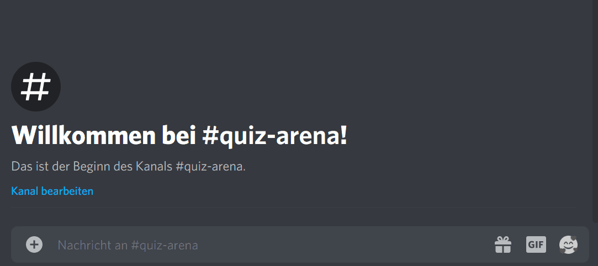

# DiScored

A Bot that helps you tracking player scores while hosting games on Discord.

## Introduction

My friends and me visit Pub Quizzes from time to time. Of course we weren't allowed to do that during the COVID-19 lockdown. That's why we decided to make our own private quiz and meet up on Discord. To help the quizmaster tracking the points of each player, I wrote this little Discord Bot named **DiScored** - you get the pun.

## Getting Started

1. Download the [latest **DiScored** release](https://github.com/selmaohneh/DiScored/releases) or clone the repository and build the project yourself!
2. Create a bot account via the Discord Applications Portal. The guys from [Discord.Net](https://github.com/discord-net/Discord.Net) have a nice tutorial [right here](https://discord.foxbot.me/stable/guides/getting_started/first-bot.html) - just follow the parts under **Creating a Discord Bot** and **Adding your bot to a server** and you should be good to go.
3. Run **DiScored** and start playing! :-)

## Commands
**DiScored** just has a few easy to remember commands:
* **!new** creates a new game with any amount of players. Example: `!new homer marge bart`
* **!score** adds points to a player. Examples: `!score marge 3`, `!score bart 2,5`, `!score homer -42`. 
Not specifying the points will add 1 point to the given player. You can optionally append a comment that will be echoed by **DiScored**. You could use that e.g. for recording the corresponding answer that led to the score. Examples: `!score bart 7 Skateboard` (adds 7 points to bart because he guessed the right answer 'Skateboard'), `!score homer Beer` (adds 1 point to homer because he guessed the right answer 'Beer').
* **!standings** shows the current standings,

Only the user that created the game via **!new** is allowed to use the **!score** command - no room for cheaters ;-)

## Contributing

* Pull requests are always welcome!
* [Kaffee? :-)](https://www.buymeacoffee.com/SaMAsU1N6)
